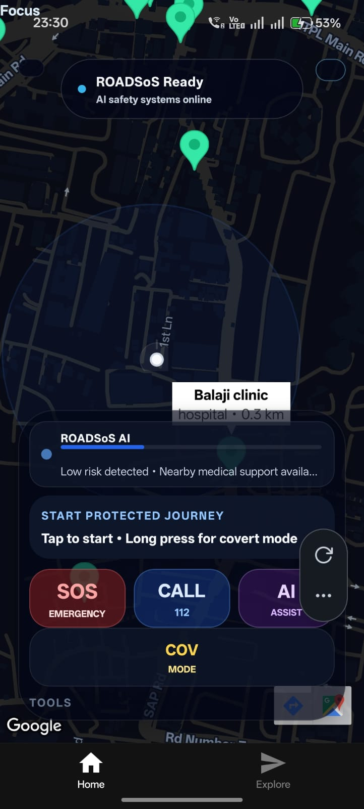
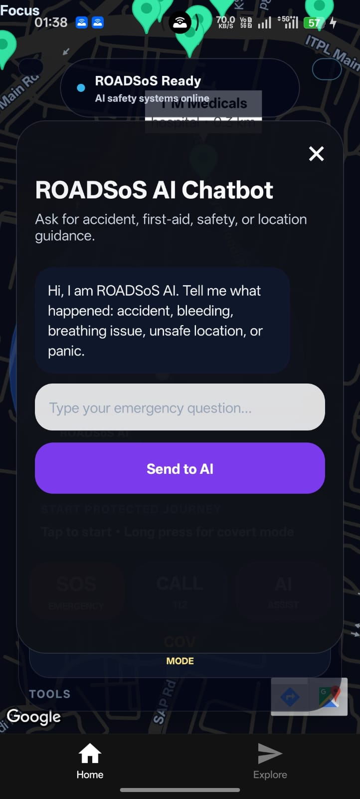
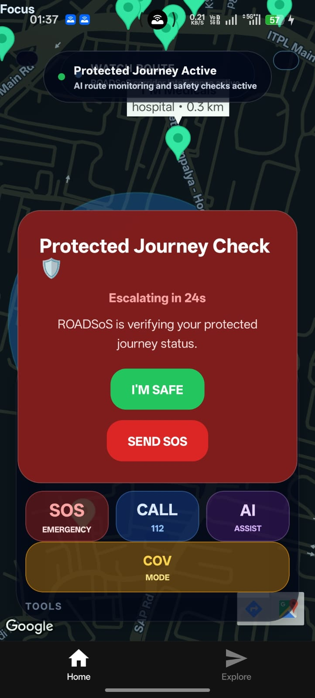
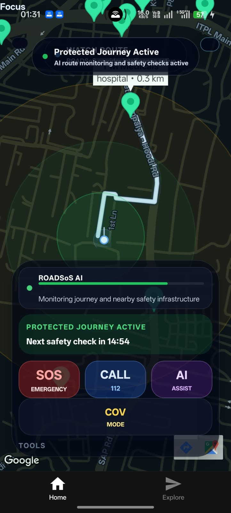
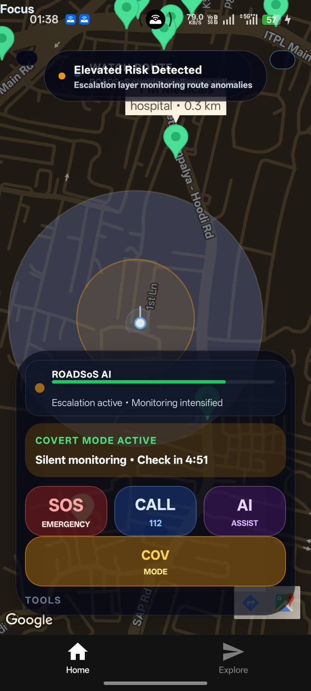
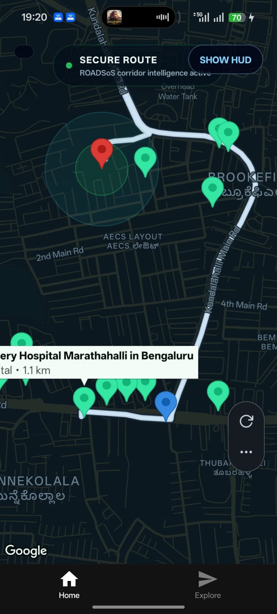
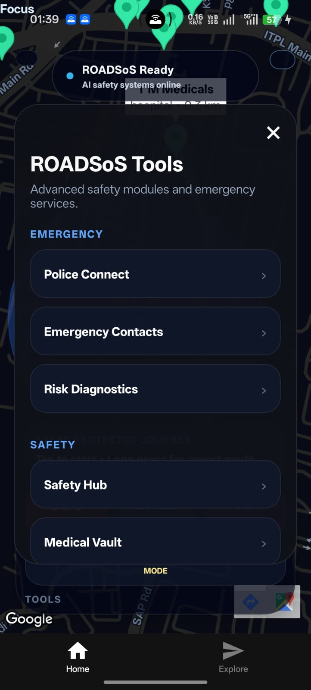
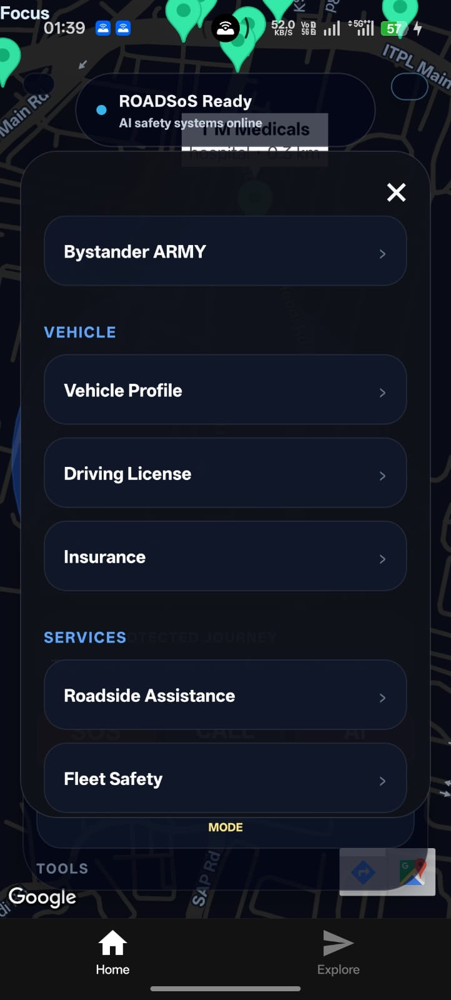
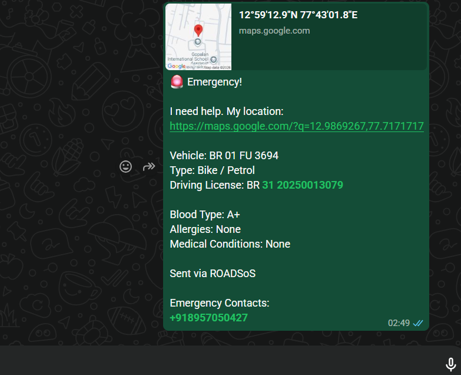

# ROADSoS

## AI-Powered Intelligent Safety Operating System for Protected Mobility

ROADSoS is a mobile-first intelligent road safety and emergency response platform designed for protected journeys, silent safety, accident response, and AI-assisted situational awareness.

Unlike traditional emergency apps, ROADSoS is built as a map-first personal safety operating system. It focuses on intelligent protection before, during, and after road emergencies through immersive live maps, protected routing, covert safety, and calm emergency UX.

Built for the **IIT Madras COERS Road Safety Hackathon 2026**.

---

## Vision

ROADSoS reimagines road safety as an intelligent protection layer around movement.

The goal is not to create another emergency button app.

ROADSoS is designed to feel like:

> an intelligent personal safety operating system for protected mobility.

The platform focuses on:

- protected journeys
- real-time situational awareness
- silent emergency escalation
- intelligent route supervision
- accident response
- nearby hospital and police access
- calm operational dark-mode UX
- emotionally trustworthy safety interactions

---

## Screenshots

> App running on Android — Operational Dark Mode

| Operational Map | Protected Journey | SOS Panel | AI Safety Assistant |
|---|---|---|---|
| Immersive live map with emergency intelligence | Real road-following protected route | Emergency actions and covert safety | Road safety and first-aid guidance |

Add screenshots here:

```md










```

---

## Key Features

### Protected Journey Intelligence

- Start protected journeys inside ROADSoS
- Real road-following route rendering
- In-app protected route generation using Google Directions API
- Hospital and police markers generate protected routes directly inside the app
- No redirect to Google Maps for protected journeys
- Protected destination locking
- Protected corridor visualization
- Route progression rendering
- Movement-aware camera framing
- Route look-ahead camera behavior
- Route deviation detection for safety escalation
- Corridor intelligence strip for route safety awareness

---

### Intelligent Route Supervision

ROADSoS does not simply draw a route.

It supervises movement through a protected corridor experience.

The route system includes:

- road-following polyline rendering
- active protected corridor styling
- completed vs remaining route visualization
- intelligent camera fitting
- forward-looking movement framing
- route deviation detection
- calm escalation-ready route state

This makes the journey feel monitored, protected, and operational.

---

### Emergency SOS System

- One-tap SOS actions
- Call 112 directly from the app
- SMS emergency contacts with live location
- WhatsApp emergency sharing
- Real-time live location link
- Emergency countdown logic
- Accident detection using accelerometer data
- SOS messages include location, vehicle, medical, and identity details

---

### Covert Protection Mode

Covert Protection Mode is designed for unsafe situations where openly asking for help may not be safe.

Features include:

- silent safety mode
- hidden calculator trigger
- secret PIN-based SOS activation
- covert escalation logic
- silent protected journey behavior
- reduced visible emergency interaction
- discreet safety workflow

---

### Safe Calc

Safe Calc is a hidden emergency trigger disguised as a calculator.

- Opens like a normal calculator
- Secret PIN `112=` activates silent SOS logic
- Designed for unsafe or threatening situations
- Supports covert emergency behavior without drawing attention

---

### Accident Detection

ROADSoS uses device motion data to detect sudden impact patterns.

- Accelerometer-based accident detection
- Automatic emergency countdown
- User can cancel if safe
- If not cancelled, SOS flow is triggered
- Designed as a foundation for crash response automation

---

### AI Safety Assistant

ROADSoS includes an emergency guidance assistant for road safety situations.

It can guide users through:

- accidents
- bleeding
- unconsciousness
- breathing problems
- fractures
- burns
- road rage or unsafe situations
- vehicle breakdowns
- emergency number guidance

The assistant provides calm, step-by-step safety instructions.

---

### AI Risk Shield

ROADSoS calculates safety risk based on contextual signals such as:

- night travel
- nearby hospitals
- nearby police support
- movement anomalies
- saved emergency contacts
- protected journey state
- covert mode state

Risk levels:

- LOW
- MODERATE
- HIGH

The map atmosphere and safety behavior adapt based on risk.

---

### Live Emergency Infrastructure

- Nearby hospitals
- Nearby police stations
- Nearby emergency support points
- Color-coded emergency markers
- Distance-aware emergency points
- Tap hospital or police markers to generate in-app protected route

---

### Medical Vault

Medical Vault stores essential emergency medical information locally.

Supported data:

- blood type
- allergies
- medications
- medical conditions
- primary contact name
- primary contact phone

This information can be attached to SOS messages during emergencies.

---

### Vehicle & Identity Safety

ROADSoS supports local vehicle and identity details for emergency response.

Includes:

- vehicle number
- vehicle type
- fuel type
- driving license holder name
- driving license number
- license validity
- DigiLocker / Parivahan verification links

These details can be included in emergency messages.

---

### Police Connect

Police Connect provides quick access to police emergency actions.

- Call 112
- Share police SOS message
- SMS emergency contacts with police alert
- Include live location and vehicle details

---

### Roadside Assistance

ROADSoS includes roadside assistance flows for:

- towing
- mechanic help
- fuel support
- EV charging support

The app prepares location-aware assistance requests.

---

## Technology Stack

### Frontend

| Technology | Usage |
|---|---|
| React Native | Mobile app framework |
| Expo | App runtime and development platform |
| TypeScript | Type safety |
| Expo Router | File-based navigation |
| react-native-maps | Google Maps rendering |
| React Native Reanimated | Smooth motion and transitions |
| Expo Location | GPS and live location |
| Expo Sensors | Accelerometer accident detection |
| Expo Blur | Glass-style interface elements |
| AsyncStorage | Local offline data storage |
| Axios | API communication |

---

### Backend & Services

| Technology / Service | Usage |
|---|---|
| FastAPI | Backend API foundation |
| Google Maps SDK | Live map rendering |
| Google Directions API | Protected journey route generation |
| OpenStreetMap / Overpass API | Nearby hospitals and police |
| EAS Build | Android APK build pipeline |

---

## Architecture Philosophy

ROADSoS follows a map-first operational safety architecture.

The app is designed around:

- immersive situational awareness
- intelligent movement supervision
- calm emergency UX
- operational restraint
- hidden complexity
- trust psychology
- silent safety
- emotionally believable emergency systems

ROADSoS intentionally avoids:

- dashboard clutter
- panic-heavy UI
- excessive gamification
- cyberpunk visual overload
- unnecessary interface complexity
- distracting emergency controls

The product goal is simple:

> Make users feel that the system is quietly protecting their journey.

---

## UX Philosophy

ROADSoS is built around calm under pressure.

Every interface element must justify stealing attention from the map.

The design direction prioritizes:

- map dominance
- dark operational atmosphere
- minimal emergency friction
- subtle escalation feedback
- intelligent route confidence
- mature futuristic visuals
- emotional trust

ROADSoS should feel like intelligent civilian safety infrastructure, not a gaming HUD or a generic navigation clone.

---

## Project Structure

```txt
roadsos-fullstack/
├── app/
│   ├── (tabs)/
│   │   └── index.tsx
│   └── _layout.tsx
├── components/
│   └── home/
│       ├── MapSection.tsx
│       ├── SOSPanel.tsx
│       ├── ChatbotPanel.tsx
│       ├── ContactsPanel.tsx
│       ├── MedicalVault.tsx
│       ├── PanelModal.tsx
│       └── RiskFullPanel.tsx
├── functions/
│   ├── directionsEngine.ts
│   └── safetyStateMachine.ts
├── assets/
├── backend/
├── package.json
├── app.config.js
├── eas.json
└── README.md
```

---

## Installation & Setup

### Prerequisites

- Node.js 18+
- Expo CLI
- Android Studio or Expo Go
- Google Cloud account
- Google Maps SDK enabled
- Google Directions API enabled

---

### 1. Clone Repository

```bash
git clone https://github.com/singhabhigyan007devil-cpu/roadsos-fullstack.git
cd roadsos-fullstack
```

---

### 2. Install Dependencies

```bash
npm install
```

---

### 3. Create Environment File

Create a `.env` file in the project root:

```env
EXPO_PUBLIC_GOOGLE_MAPS_API_KEY=YOUR_GOOGLE_MAPS_API_KEY
```

Never commit `.env` to GitHub.

---

### 4. Start Development Server

```bash
npx expo start
```

---

### 5. Run on Android

```bash
npx expo run:android
```

---

## APK Build

### EAS Cloud Build

```bash
eas build --platform android --profile production
```

---

### Local Android Build

```bash
npx expo run:android --variant release
```

---

## Security & Privacy

- API keys are stored outside source code
- `.env` files are excluded from Git tracking
- Medical Vault data is stored locally on device
- Emergency contacts are stored locally
- Driving license details are stored locally
- Sensitive data is shared only during emergency actions
- Covert Mode supports silent emergency activation
- SOS messages require user-configured emergency contacts

---

## Demo Flow

Recommended demo sequence:

1. Open ROADSoS operational dark-mode map
2. Show nearby hospitals and police markers
3. Tap a hospital or police marker
4. Start Protected Journey
5. Show real road-following route inside ROADSoS
6. Show protected corridor and route progression
7. Trigger Covert Protection Mode
8. Show hidden Safe Calc trigger
9. Simulate accident detection or SOS flow
10. Show emergency message with live location, vehicle, license, and medical details

---

## Evaluation Criteria Coverage

| Criteria | ROADSoS Implementation |
|---|---|
| Nearby Police & Hospitals | Live emergency markers and routing |
| Emergency Response | SOS, SMS, WhatsApp, call 112, live location |
| Accident Support | Accelerometer-based accident detection |
| Protected Travel | Real protected journey routing and corridor visualization |
| Innovation | Covert Mode, Safe Calc, route deviation detection, corridor intelligence |
| Offline Functionality | Local chatbot logic, AsyncStorage data, medical vault, contacts |
| Reliability | Real-time GPS, Google Directions API, OpenStreetMap emergency infrastructure |
| Information Integration | Medical, vehicle, license, contacts, and location in SOS flow |
| User Interface | Operational dark-mode emergency UX |
| Global Adaptability | Country code support and map-based emergency routing |

---

## Current Project Status

ROADSoS has evolved from an emergency utility prototype into a coherent intelligent mobility safety system.

Current completed foundation:

- map-first operational interface
- protected journey routing
- road-following polyline rendering
- route progression visualization
- hospital and police in-app routing
- covert protection
- SOS actions
- accident detection
- risk-aware map atmosphere
- medical vault
- police connect
- roadside assistance
- AI safety assistant foundation

Current focus:

- stability
- polish
- submission readiness
- reliable Android demo experience

---

## Future Scope

- Advanced route recovery intelligence
- Guardian live monitoring
- Smartwatch gesture SOS
- Offline map caching
- Predictive accident hotspot detection
- AI-powered safer route recommendation
- Multi-language emergency support
- Urban safety intelligence network
- Emergency responder dashboard
- Real-time protected journey sharing

---

## Author

**Abhigyan Singh**

GitHub: [@singhabhigyan007devil-cpu](https://github.com/singhabhigyan007devil-cpu)

---

## License

This project is licensed under the MIT License.

---

> Every second matters. Stay calm. Call help fast.  
> — ROADSoS